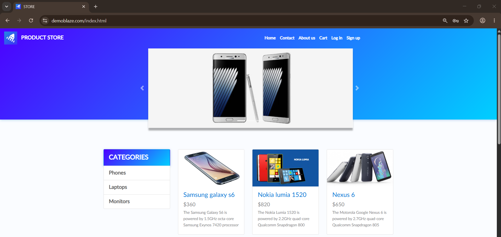
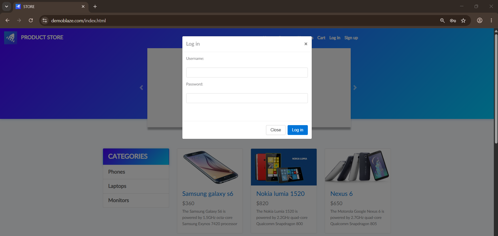
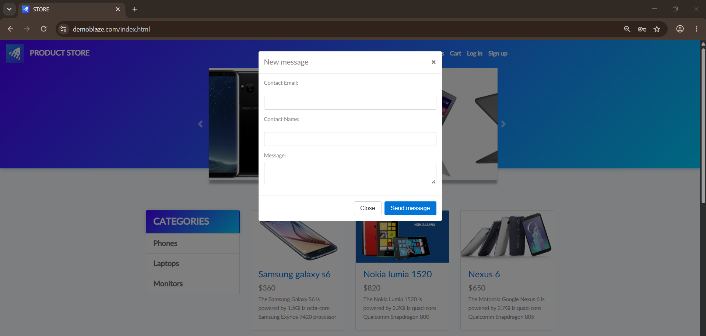
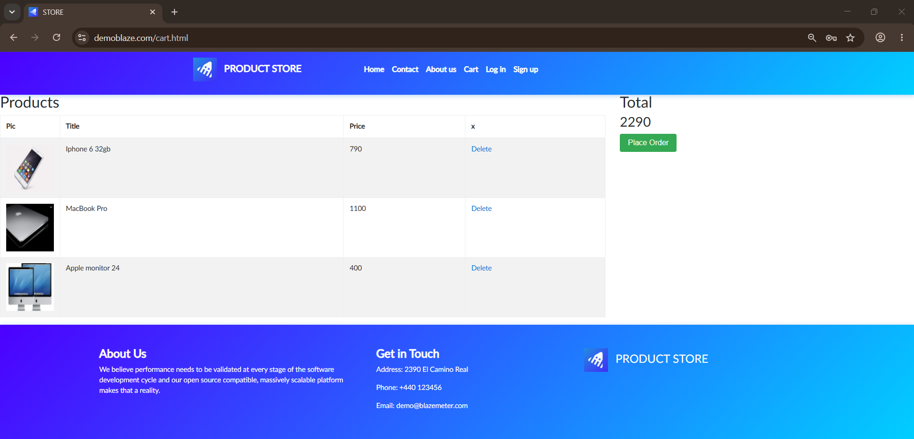

# 🚀 DemoBlaze Manual Testing Project

## End-to-End Manual Testing for DemoBlaze E-Commerce Website


> A comprehensive **Manual Testing Project** for the **DemoBlaze E-Commerce Website**, covering complete Software Testing Life Cycle (STLC) activities including Test Scenario Design, Test Case Creation, Test Execution, Defect Reporting, and Test Summary Reporting.

---

# 🌐 Application Under Test

**Website**

https://www.demoblaze.com/index.html

---

# 📌 Project Summary

| Item | Details |
|------|---------|
| **Project Type** | Manual Testing |
| **Application** | DemoBlaze |
| **Domain** | E-Commerce |
| **Testing Approach** | Functional Manual Testing |
| **Documentation Tool** | Microsoft Excel |
| **Defect Tracking** | Bug Report |
| **Methodology** | STLC |
| **Project Status** | ✅ Completed |

---

# 📖 Project Overview

The objective of this project is to validate the functionality of the DemoBlaze E-Commerce web application through comprehensive manual testing.

The testing process includes creating structured test scenarios, designing detailed test cases, executing test cases, reporting defects, documenting execution results, and preparing a complete Test Summary Report following QA industry best practices.

---

# 🎯 Project Objectives

- Validate all core business functionalities.
- Verify application behavior under positive and negative scenarios.
- Identify functional defects.
- Ensure complete business workflow coverage.
- Produce professional QA documentation.
- Improve software quality through structured testing.

---

# 👨‍💻 My Responsibilities

- Requirement Analysis
- Test Scenario Design
- Test Case Design
- Test Data Preparation
- Functional Testing
- Positive & Negative Testing
- Boundary Value Testing
- Test Execution
- Bug Reporting
- Test Summary Reporting

---

# ✅ Project Highlights

- ✔ Complete End-to-End Manual Testing
- ✔ Professional Test Documentation
- ✔ Functional Testing
- ✔ Positive Testing
- ✔ Negative Testing
- ✔ Boundary Testing
- ✔ Validation Testing
- ✔ Test Execution Tracking
- ✔ Bug Reporting
- ✔ Test Summary Report
- ✔ Evidence Collection

---

# 🧪 Modules Covered

- 🏠 Home Page
- 📝 Sign Up
- 🔐 Login
- 🚪 Logout
- 📩 Contact
- ℹ️ About Us
- 📂 Categories
- 📱 Product Details
- 🛒 Cart
- 💳 Place Order (Checkout)

---

# 🧾 Testing Types

- Functional Testing
- UI Testing
- Positive Testing
- Negative Testing
- Validation Testing
- Boundary Value Analysis (BVA)
- Smoke Testing
- Regression Testing (Manual)

---

# 📂 Project Deliverables

| Deliverable | Status |
|-------------|--------|
| Test Scenarios | ✅ Completed |
| Test Cases | ✅ Completed |
| Test Execution Sheet | ✅ Completed |
| Bug Report | ✅ Completed |
| Test Summary Report | ✅ Completed |
| Test Evidence | ✅ Completed |

---

# 📁 Repository Structure

```text
demoblaze-manual-testing
│
├── Bug Report
│
├── Test Cases
│
├── Test Execution
│
├── images
│
└── README.md
```

---

# 🛠 Tools Used

| Tool | Purpose |
|------|---------|
| Microsoft Excel | Test Documentation |
| Google Chrome | Browser Testing |
| Windows 11 | Test Environment |
| Git | Version Control |
| GitHub | Repository Hosting |

---

# 📸 Project Screenshots

## 🏠 Home Page



---

## 📝 Sign Up


---

## 🔐 Login



---

## 📩 Contact



---

## ℹ️ About Us


---

## 📱 Product Details


---

## 🛒 Cart



---

# 📈 Skills Demonstrated

- Manual Testing
- Functional Testing
- Test Scenario Design
- Test Case Design
- Test Execution
- Bug Reporting
- Defect Tracking
- Regression Testing
- Smoke Testing
- Boundary Value Analysis (BVA)
- Validation Testing
- SDLC
- STLC
- QA Documentation
- Microsoft Excel
- Git
- GitHub

---

# 📂 Repository

**GitHub Repository**

https://github.com/muhammed-elgarf/demoblaze-manual-testing

---

# 📁 Project Files

The repository contains the following testing artifacts:

- 📄 Test Cases
- 📄 Bug Report
- 📄 Test Execution Sheet
- 📄 Test Summary Report
- 🖼 Project Screenshots

---

# ☁️ Google Drive

Project documentation is also available on Google Drive:

https://drive.google.com/drive/folders/1IzUwbCgEaX5o7k3omzTxfxoRz_kzT91c?usp=drive_link

---

# 👨‍💻 Author

## Muhammed El-Garf

**Software QA Engineer**

- Manual Testing
- Automation Testing
- API Testing

---

# 🌐 Connect With Me

## 💼 LinkedIn

https://www.linkedin.com/in/muhammed-el-garf-798bb432a/

---

## 💻 GitHub

https://github.com/muhammed-elgarf

---

## 🌍 Portfolio

https://muhammed-elgarf.github.io/Portfolio-Muhammed-Raafat/

---

## 📧 Email

muhamedelgarf2@gmail.com

---

# ⭐ Support

If you found this project helpful, please consider giving this repository a ⭐ on GitHub.

---

# 📄 License

This repository was created for educational purposes, portfolio presentation, and demonstrating practical Manual Testing skills following industry-standard QA documentation practices.
# 🚀 DemoBlaze Manual Testing Project

## End-to-End Manual Testing for DemoBlaze E-Commerce Website


> A comprehensive **Manual Testing Project** for the **DemoBlaze E-Commerce Website**, covering complete Software Testing Life Cycle (STLC) activities including Test Scenario Design, Test Case Creation, Test Execution, Defect Reporting, and Test Summary Reporting.

---

# 🌐 Application Under Test

**Website**

https://www.demoblaze.com/index.html

---

# 📌 Project Summary

| Item | Details |
|------|---------|
| **Project Type** | Manual Testing |
| **Application** | DemoBlaze |
| **Domain** | E-Commerce |
| **Testing Approach** | Functional Manual Testing |
| **Documentation Tool** | Microsoft Excel |
| **Defect Tracking** | Bug Report |
| **Methodology** | STLC |
| **Project Status** | ✅ Completed |

---

# 📖 Project Overview

The objective of this project is to validate the functionality of the DemoBlaze E-Commerce web application through comprehensive manual testing.

The testing process includes creating structured test scenarios, designing detailed test cases, executing test cases, reporting defects, documenting execution results, and preparing a complete Test Summary Report following QA industry best practices.

---

# 🎯 Project Objectives

- Validate all core business functionalities.
- Verify application behavior under positive and negative scenarios.
- Identify functional defects.
- Ensure complete business workflow coverage.
- Produce professional QA documentation.
- Improve software quality through structured testing.

---

# 👨‍💻 My Responsibilities

- Requirement Analysis
- Test Scenario Design
- Test Case Design
- Test Data Preparation
- Functional Testing
- Positive & Negative Testing
- Boundary Value Testing
- Test Execution
- Bug Reporting
- Test Summary Reporting

---

# ✅ Project Highlights

- ✔ Complete End-to-End Manual Testing
- ✔ Professional Test Documentation
- ✔ Functional Testing
- ✔ Positive Testing
- ✔ Negative Testing
- ✔ Boundary Testing
- ✔ Validation Testing
- ✔ Test Execution Tracking
- ✔ Bug Reporting
- ✔ Test Summary Report
- ✔ Evidence Collection

---

# 🧪 Modules Covered

- 🏠 Home Page
- 📝 Sign Up
- 🔐 Login
- 🚪 Logout
- 📩 Contact
- ℹ️ About Us
- 📂 Categories
- 📱 Product Details
- 🛒 Cart
- 💳 Place Order (Checkout)

---

# 🧾 Testing Types

- Functional Testing
- UI Testing
- Positive Testing
- Negative Testing
- Validation Testing
- Boundary Value Analysis (BVA)
- Smoke Testing
- Regression Testing (Manual)

---

# 📂 Project Deliverables

| Deliverable | Status |
|-------------|--------|
| Test Scenarios | ✅ Completed |
| Test Cases | ✅ Completed |
| Test Execution Sheet | ✅ Completed |
| Bug Report | ✅ Completed |
| Test Summary Report | ✅ Completed |
| Test Evidence | ✅ Completed |

---

# 📁 Repository Structure

```text
demoblaze-manual-testing
│
├── Bug Report
│
├── Test Cases
│
├── Test Execution
│
├── images
│
└── README.md
```

---

# 🛠 Tools Used

| Tool | Purpose |
|------|---------|
| Microsoft Excel | Test Documentation |
| Google Chrome | Browser Testing |
| Windows 11 | Test Environment |
| Git | Version Control |
| GitHub | Repository Hosting |

---

# 📸 Project Screenshots

## 🏠 Home Page


---

## 📝 Sign Up


---

## 🔐 Login


---

## 📩 Contact


---

## ℹ️ About Us


---

## 📱 Product Details


---

## 🛒 Cart


---

# 📈 Skills Demonstrated

- Manual Testing
- Functional Testing
- Test Scenario Design
- Test Case Design
- Test Execution
- Bug Reporting
- Defect Tracking
- Regression Testing
- Smoke Testing
- Boundary Value Analysis (BVA)
- Validation Testing
- SDLC
- STLC
- QA Documentation
- Microsoft Excel
- Git
- GitHub

---

# 📂 Repository
https://github.com/muhammed-elgarf/demoblaze-manual-testing
**GitHub Repository**

---

# 📁 Project Files

The repository contains the following testing artifacts:

- 📄 Test Cases
- 📄 Bug Report
- 📄 Test Execution Sheet
- 📄 Test Summary Report
- 🖼 Project Screenshots

---

# ☁️ Google Drive

Project documentation is also available on Google Drive:

https://drive.google.com/drive/folders/1IzUwbCgEaX5o7k3omzTxfxoRz_kzT91c?usp=drive_link

---

# 👨‍💻 Author

## Muhammed El-Garf

**Software QA Engineer**

- Manual Testing
- Automation Testing
- API Testing

---

# 🌐 Connect With Me

## 💼 LinkedIn

https://www.linkedin.com/in/muhammed-el-garf-798bb432a/

---

## 💻 GitHub

https://github.com/muhammed-elgarf

---

## 🌍 Portfolio

https://muhammed-elgarf.github.io/Portfolio-Muhammed-Raafat/

---

## 📧 Email

muhamedelgarf2@gmail.com

---

# ⭐ Support

If you found this project helpful, please consider giving this repository a ⭐ on GitHub.

---

# 📄 License

This repository was created for educational purposes, portfolio presentation, and demonstrating practical Manual Testing skills following industry-standard QA documentation practices.
